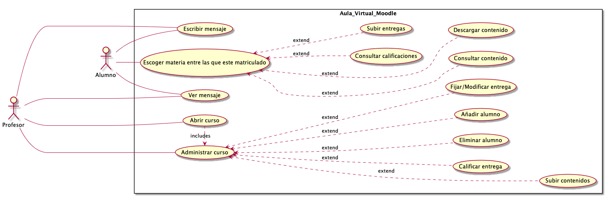

PCV06-10
===

**Ejercicio 1: Caso de uso fábrica embutidos**

--- 

---
   
**Ejercicio 2: Caso de uso moodle aula virtual**

- No he añadido la gestión de grupos porque según mi diagrama, el profesor que ha creado el grupo es el que tiene permisos para añadir y elmimar alumnos de un curso (lo que sería lo mismo que gestionar los grupos, pero encima así especifico que el profesor que gestiona el curso y los alumnos que pertenecen a este es el mismo profesor que ha creado el curso).

---

